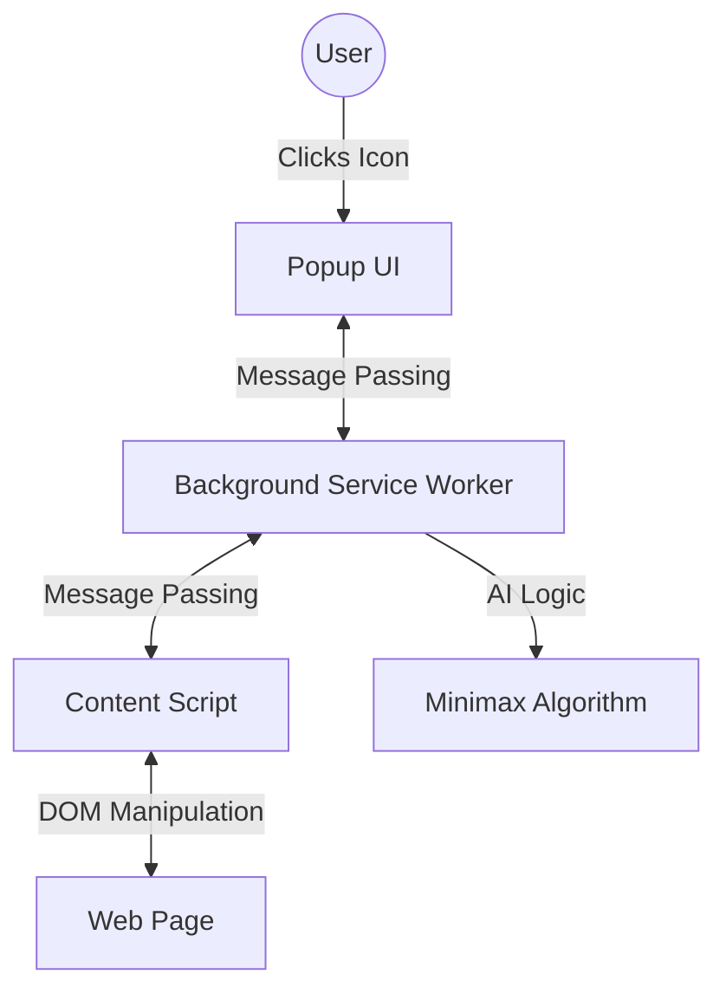

# project name

---

[project name ✅](https://axlgoze.github.io/project-name/)

summary
Una extensión de Chrome no es un solo bloque de código; son procesos separados:

Popup: El HTML/JS que ves al hacer clic en el icono (se destruye al cerrar el popup).

Content Script: El código que vive "dentro" de la página web que estás viendo.

Background Service Worker: El cerebro que vive en segundo plano.

**Tech Stack:**

- **Languages:** HTML5, CSS3, JavaScript (ES6+).
- **Tools/Frameworks:** BEM Methodology, DOM Manipulation.

---

## Visual Flow Map (Architecture)

## Design & Roadmap

Roadmap:

- [ ] Implement a Minimax algorithm for a Single Player AI mode.

- [ ].

## Contribution & Testing

### How to Contribute

## Testing

## Lessons Learned

---

### About me

[linkedin](https://www.linkedin.com/in/axel-reyes-wd/)

requeriments

como diseñador/programador quiero poder seleccionar un color de cualquier parte de la pantalla y que se guarde en localStorage

como diseñador/programador quiero poder ver el color seleccionado en formato HEX y RGB

como diseñador/programador quiero poder copiar el color seleccionado en formato HEX y RGB al dar click sobre el color.

como diseñador/programador quiero poder ver el color complementario al color seleccionado con una intensidad muy alta (sera el contraste del color seleccionado)

como diseñador/programador quiero poder ver tres colores extras que sean analogos del color seleccionado.

cada color visible en la interfaz debera tener etiquetas con el valor en HEX y RGB y un boton para copiar el valor al portapapeles.

el boton sera la misma caja del color, al dar click sobre la caja se copiara el valor al portapapeles.

el sistema puede guardar los colores seleccionados en localStorage.

Module Responsibility
colorModel.js Color math, conversion, & chrome.storage
popupView.js DOM rendering & event binding only
popupController.js Orchestration between Model and View

errores que tuve al programar
pero mi renderColorPallete debe pintar asi ¿como podria ser mas clean code?

export function renderColorPallete(colorPalette, targetElement) {
    if (!colorPalette || !Array.isArray(colorPalette)) return null;
    // recibe del storage si existe la paleta
    // renderizar los colores en el DOM
    if (targetElement) return

}
