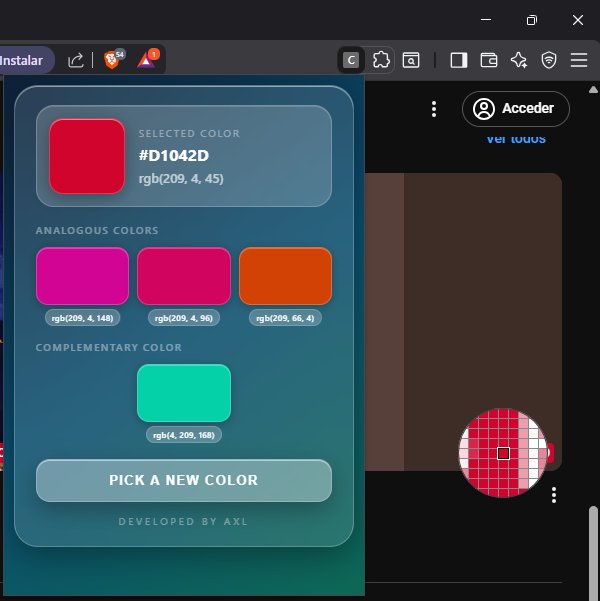
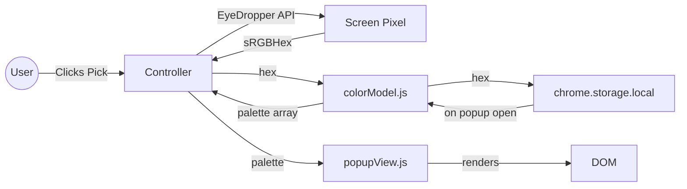
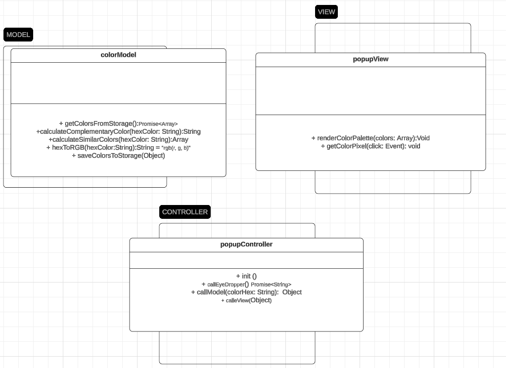

# 🎨 Color Picker Extension

A Chrome Extension that lets designers and developers **pick any color from the screen** and instantly see its full analogous + complementary palette with one-click copy to clipboard.

> ✅ Also works on **Microsoft Edge** and **Brave** — any Chromium-based browser that supports the EyeDropper API and Manifest V3.

---

## Live Demo / Install

> Load unpacked from the `dist/` folder — see [Installation](#installation).



---

## Features

- 🎯 **Pick any pixel** on screen using the native EyeDropper API
- 🔵 **Hex + RGB** values shown for every color
- 📋 **Click to copy** — click a color box to copy its HEX, click the label to copy its RGB
- 🔁 **Complementary color** — calculated via 180° hue rotation in HSL space
- 🎨 **3 analogous colors** — hue shifts of −30°, −15°, +30° from the base
- 💾 **Persistent storage** — last picked color reloads automatically when you reopen the popup
- 🧱 Clean **MVC architecture** with fully unit-tested model layer

---

## Architecture

### Module Responsibilities

| Module          | Responsibility                                           |
| --------------- | -------------------------------------------------------- |
| `colorModel.js` | Color math, format conversion, chrome.storage read/write |
| `popupView.js`  | DOM rendering, copy-to-clipboard, event binding          |
| `controller.js` | Orchestration — calls Model, returns result to View      |
| `main.js`       | Entry point — loads saved color on open, wires events    |

### Data Flow



### Class / Function Map



---

## Color Math — Key Design Decisions

### Why HSL instead of RGB subtraction?

When calculating complementary colors there are two approaches:

| Approach            | How                         | Result                          |
| ------------------- | --------------------------- | ------------------------------- |
| **RGB subtraction** | `255 - r, 255 - g, 255 - b` | "Inverts" brightness levels     |
| **HSL rotation** ✅ | `H + 180°`                  | True color-theory complementary |

We chose HSL rotation because it produces the **actual complementary hue** — the color directly across the color wheel — which is what designers expect.

### Analogous color angles: `[-30°, -15°, +30°]`

We deliberately avoided the symmetric `[-30°, 0°, +30°]` set because the 0° offset just duplicates the base color. The asymmetric set gives three visually distinct colors while staying within the analogous zone.

### `generateFullPallete` output format — Atomic Palette Entity

Each item in the returned array is a self-contained object:

```js
{ hex: '#FF5733', rgb: 'rgb(255, 87, 51)', label: 'selected' }
```

This was a conscious decision over returning `{ hex: [], rgb: [] }` arrays — the atomic format keeps hex and rgb tightly coupled so the View never has to zip two arrays together.

---

## Tech Stack

| Layer         | Technology                           |
| ------------- | ------------------------------------ |
| Core          | HTML5, CSS3, JavaScript ES Modules   |
| Build         | Vite 6                               |
| Testing       | Vitest + jsdom                       |
| Linting       | ESLint 10 (flat config) + Prettier   |
| Git hooks     | Husky + lint-staged (pre-commit)     |
| Extension API | EyeDropper API, chrome.storage.local |
| Manifest      | Chrome Extension Manifest V3         |

---

## Project Structure

```
color-picker-extension/
├── public/
│   └── manifest.json         # Chrome Extension manifest (copied to dist/)
├── src/
│   └── js/
│       ├── colorModel.js     # Model: color math + storage
│       ├── popupView.js      # View: rendering + copy-to-clipboard
│       └── controller.js     # Controller: orchestration
├── tests/
│   ├── colorModel/           # Model unit tests (TDD)
│   ├── popupView/            # View unit tests (jsdom)
│   └── controller/           # Controller integration tests
├── assets/                   # Architecture diagrams
├── main.js                   # Popup entry point
├── main.css                  # Extension popup styles
├── index.html                # Popup HTML
├── vite.config.js            # Vite build + Vitest config
├── eslint.config.js          # ESLint flat config
└── .prettierrc               # Prettier config
```

---

## Installation

### Load in Chrome / Edge / Brave

```bash
# 1. Clone the repo
git clone https://github.com/axlgoze/color-picker-extesion.git
cd color-picker-extesion

# 2. Install dependencies
npm install

# 3. Build the extension
npm run build
```

Then in your browser:

1. Open `chrome://extensions` (or `edge://extensions` / `brave://extensions`)
2. Enable **Developer mode** (toggle, top-right)
3. Click **Load unpacked** → select the `dist/` folder
4. Click the extension icon in the toolbar

---

## Development

```bash
npm test          # Run all tests (Vitest)
npm run lint      # ESLint check
npm run format    # Prettier format
npm run build     # Vite production build → dist/
```

### Code style

- Single quotes, semicolons, 2-space indent (enforced by Prettier)
- ESLint `js/recommended` + `eslint-config-prettier`
- Pre-commit hook automatically formats and lints staged files via Husky + lint-staged

---

## Testing

The model layer was built with strict **TDD (Red → Green → Refactor)**. All color calculation functions have dedicated test files:

| Test file                             | What it covers                                                         |
| ------------------------------------- | ---------------------------------------------------------------------- |
| `colorModel.test.js`                  | `hexToRgb` — edge cases: null, empty, 3-char shorthand, invalid length |
| `calculateComplementaryColor.test.js` | Hue rotation correctness, null/empty guard                             |
| `calculateSimilarColors.test.js`      | Analogous hue offsets                                                  |
| `generateFullPalette.test.js`         | Full palette shape and values                                          |
| `saveColorToStorage.test.js`          | chrome.storage mock: save + load                                       |
| `popupView.test.js`                   | DOM rendering, child element counts, background-color                  |
| `controller.test.js`                  | EyeDropper: success, cancellation (ESC), unsupported browser           |

```bash
npm test
# 25 tests across 7 suites — all green ✅
```

---

## Lessons Learned

### Things that bit us during development

| Issue                                                                     | Lesson                                                                              |
| ------------------------------------------------------------------------- | ----------------------------------------------------------------------------------- |
| `const arr = [3]` instead of `arr = []`                                   | `[3]` creates an array **containing the number 3**, not an array of length 3        |
| `calculateSimilarColors` map overwrote all 3 slots with the same `newHue` | Each map iteration must use its own loop variable, not a shared accumulator         |
| `rgbToHsl(rgbObj)` instead of `rgbToHsl(r, g, b)`                         | Always check function signatures; JS silently passes NaN through math               |
| `hexToRgb` results used without normalizing to 0-1                        | The function returns 0-255 channels; `rgbToHsl` expects 0-1. Must divide by 255     |
| `box.style.backgroundColor` returns `rgb()` not hex                       | Browsers normalize all inline colors to `rgb()`. Use a `data-hex` attribute instead |
| `pointer-events: none` on RGB labels                                      | Blocks ALL mouse events including click and cursor change — use `cursor: pointer`   |
| `manifest.json` missing from `dist/`                                      | Vite only copies the `public/` folder. Manifest must live in `public/`              |
| `vi.mock()` in the same file as behavior tests                            | Mocking a module replaces it with a dummy — can't test real logic in the same file  |

---

## Roadmap

- [ ] Toast notification on copy (replaces title-based feedback)
- [ ] History of the last N picked colors
- [ ] Export palette as CSS variables or JSON
- [ ] Color blindness simulation mode

---

### About

Built by **AXL** · [LinkedIn](https://www.linkedin.com/in/axel-reyes-wd/)
